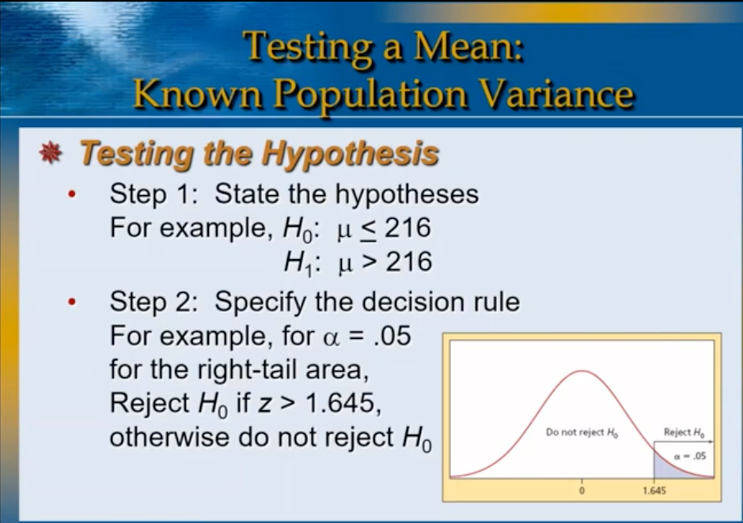
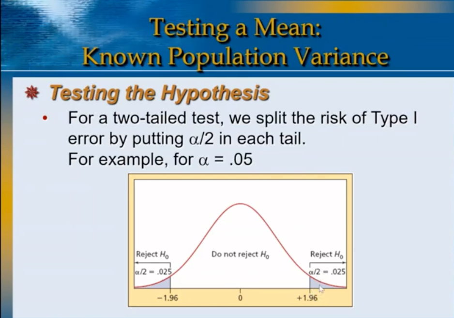
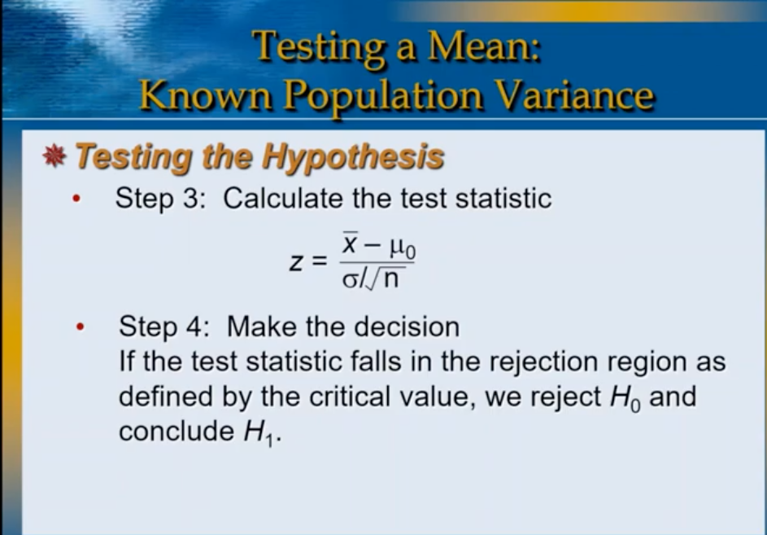
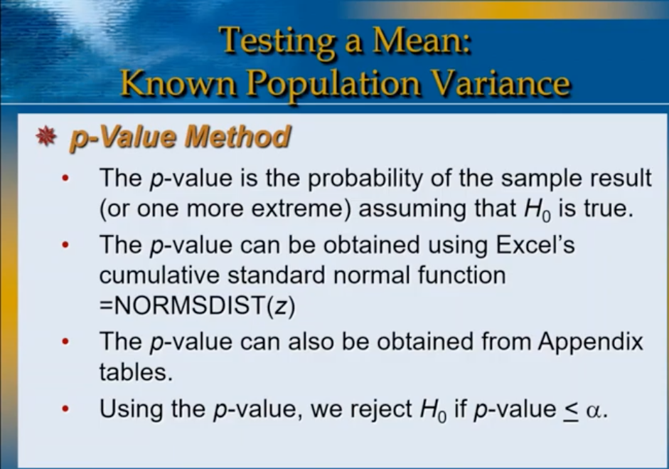
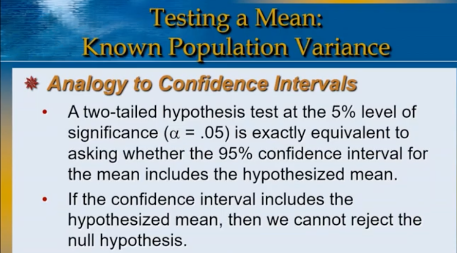
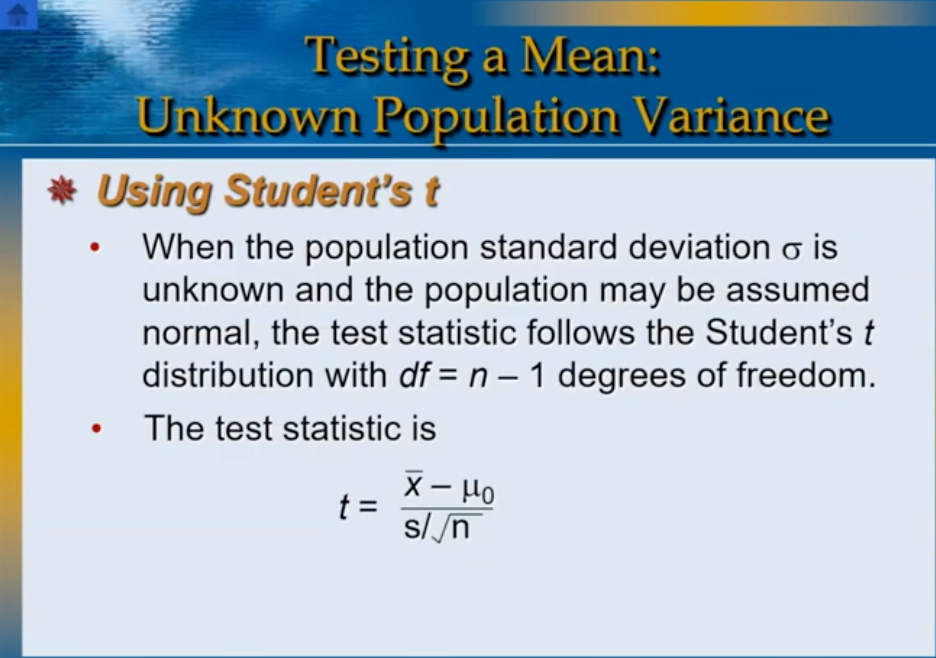
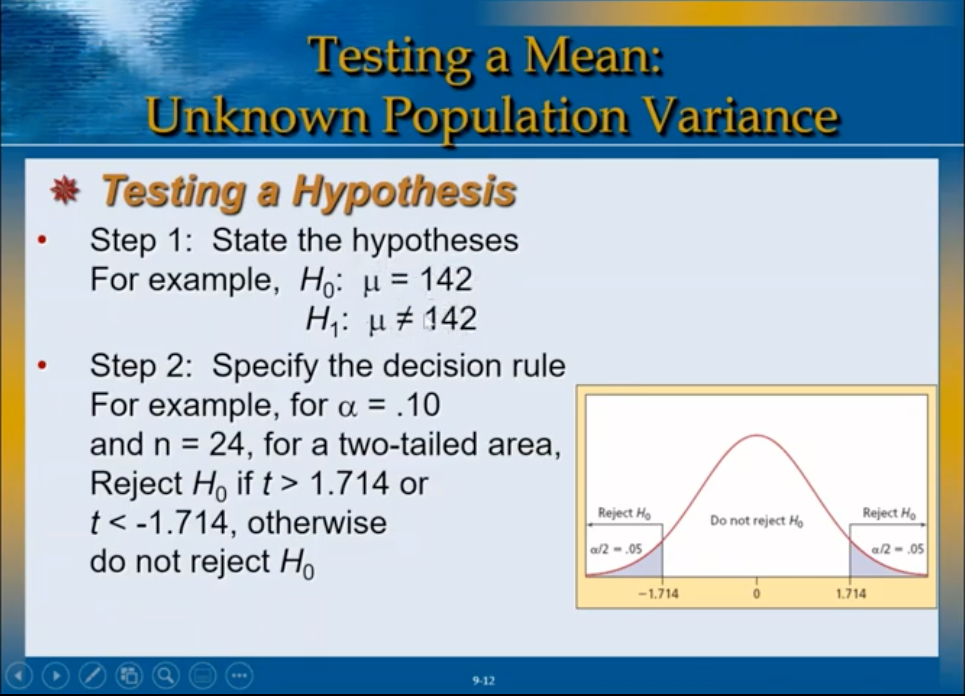
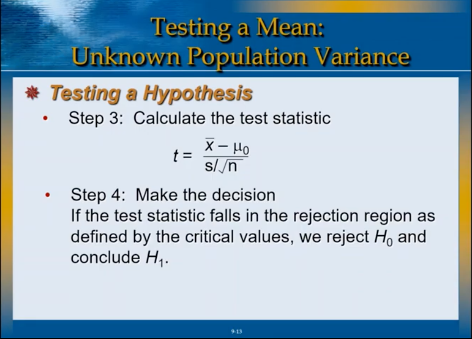

# LOGIC OF HYPOTHESIS TESTING

## Hypothesis Formulation

+ Hypotheses are a pair of mutually exclusive, collectively exhaustive statements about the world.
+ One statement or the other must be true, but they cannot both be true.
  + H0: Null Hypothesis
  + H1: Alternative Hypothesis

+ [These two statements are hypotheses because the truth is unknown]

## Statistical Hypothesis Testing

+ A Statistical hypothesis is a statement about the value of a population parameter 0.
+ A hypothesis test is a decision between two competing mutually exclusive and collectively exhaustive hypotheses about the value of 0.
 

## Statistical Hypothesis Testing CONT

+ The direction of the test is indicated by H[1]:
  + (>) indicates a right-tailed test
  + < indicates a left-tailed test
  + X= indicates a two-tailed test

# Testing a Mean: Known Population Variance

+ The hypothesized mean u[mew]0, that we are testing is a benchmark.
+ The value of u[mew]0 does not come from a sample.
+ The test statistic compares the sample mean x[x-bar] with the hypothesized mean u[mew]0.

+ The difference between x[x-bar] and u[mew]0 is divided by the
standard error of the mean (denoted popstdev).

+ The test statistic is :

+ + + 

